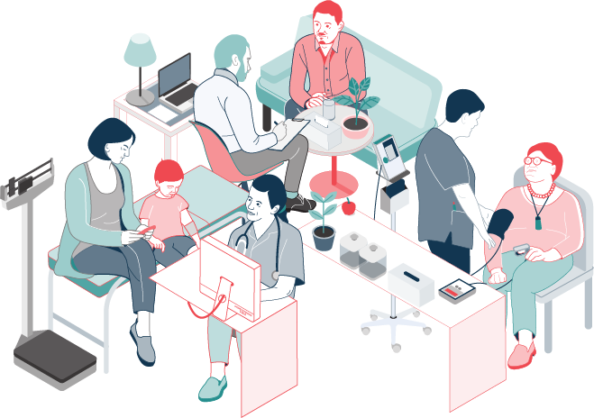

## The healthcare system is broken. We all know and accept that.

In 2020, the Health and Disability System Review (aka the Simpson Report) was charged with “recommending system-level changes that would be sustainable, lead to better and more equitable outcomes for all New Zealanders and shift the balance from treatment of illness towards health and wellbeing.”

“The challenge is clear,” according to the report. “New Zealand has a diverse population with a history of experiencing significantly different health outcomes…\[and\] a level of intergenerational poverty which, perhaps more than anything else, negatively impacts on health outcomes.

“On the positive side, New Zealand has, by world standards, a very good publicly funded health and disability system which can evolve into being more effective and more sustainable.”

## Information Breakdown

The government’s response to the Simpson Report was the Pae Ora (Healthy Futures) Act which took effect on 1 July 2022. It disestablished 20 district health boards and established Health NZ to operate hospitals and health services.

One major issue that hasn’t been addressed by the government is the lack of information sharing between social services and healthcare sectors. The review proposed “working towards a much more networked environment where the full range of primary and community services are planned with the community, where services are digitally connected so information flows as required, and where more of the services have an outreach element making it easier for whānau to stay connected to the system.”

We are in the position today to make the changes needed to build a networked environment for accessible and transparent data sharing. The Eightwire team has already built a data platform trusted to handle the most sensitive data in government and the social sector and have evolved this offering to focus specifically on securely sharing data across the healthcare sector.

We want to improve access to primary care information and improve the way information is shared between the healthcare system, the Public Service social sector, and NGOs (non-governmental organisations) working on the frontline.

## Impact on Individuals

Information and data from GPs and other healthcare providers is available but up to now it’s been siloed within the primary health organisations and is not easily available to social services and NGOs. It’s bizarre given how much social and environmental factors impact on health and wellbeing and how much improving social wellbeing can reduce healthcare costs.

Unless social services are delivered adequately, then an individual’s problems get worse until they must turn to emergency or hospital care, our most expensive health service. If we don’t provide mental health care, housing and other social services to the people that need them, they will eventually require treatment for chronic illnesses. This is the classic ambulance at the bottom of the cliff approach. Data sharing can empower social services to intervene before problems escalate and become more complicated and costly to address.

## Community Consequences

More transparent sharing of data will not only improve the health and wellbeing of individuals, it can also transform communities. Typically, the more common health issues in less well off communities are not isolated to individuals; they impact a large proportion of the population. Data sharing enables a high level view of the health and wellbeing of a community.

For example, if there are low vaccination rates in a community and easily preventable diseases are running rife as a result, the data can support the need for a campaign to improve vaccination rates. Or say there’s a high instance of respiratory diseases in a particular area that can be linked to damp, poorly insulated housing. The data can back up initiatives to improve the housing stock.

Without data, pushing through change is more challenging. With access to data you can correlate primary care information in a community with the factors that might be causing health and wellbeing issues. Agencies could easily identify communities at risk and allocate resources to deal with health and wellbeing issues before they become bigger problems, because they always become bigger problems.

Data monitoring can also predict disease outbreaks. If there’s a spike in people visiting their local doctor for gastrointestinal problems, it might be a good idea to do some environmental or water tests to figure out if there’s a common cause and contain the outbreak.

Data is the missing piece in the puzzle. If the organisations and people that care about health and wellbeing in this country want to tackle the many problems in the sector, data will play a key role in fixing those problems.

## What Makes Medicly Different?

This is a complicated system with a lot of moving parts between patients, doctors, agencies and NGOs. What makes Medicly different is we have an innovative data processing platform that automates the technology tasks required for data sharing while enforcing proper governance and security. This will drastically improve the accountability of the sector.

For the healthcare and social services sector, we can operate as a common carrier between patients, NGOs and agencies and apply a better way of operating without requiring long delivery timeframes. At the same time, Medicly brings a world leading governance and security model so that New Zealand’s healthcare data can be put to work to reduce inequality.

We all know that the healthcare system can work better for all New Zealanders.  

We believe it can be fixed.
